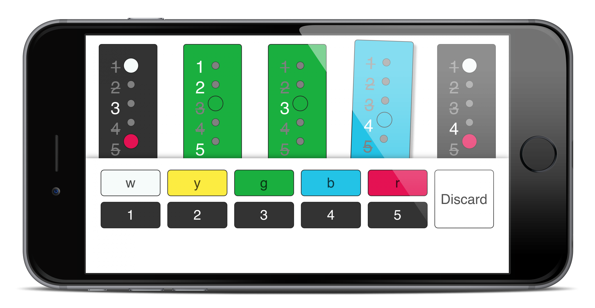

# Hanabi Hand

Keep track of the hints people have given about your hand. For the card game [Hanabi](https://en.wikipedia.org/wiki/Hanabi_(card_game)).



## Development

Install dependencies.
```
$ npm ci
```

Build the thing.
```
$ npm run build
```

Alternatively, this rebuilds when the source changes.
```
$ npm run watch
```

Open it in a browser: file:///path/to/hanabihand/dist/index.html
